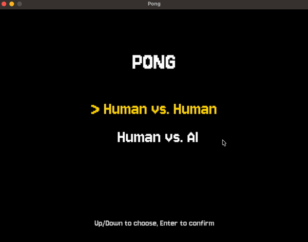

# Pong

A from-scratch implementation of the classic arcade game in Python and Pygame, featuring local two-player play and a single-player mode against a tunable AI opponent.



## Features

- **Two game modes:** Human vs. Human (local multiplayer) and Human vs. AI
- **Three AI difficulty levels:** Easy, Medium, and Hard, each with distinct paddle speed and aim error
- **Trajectory-predicting AI:** the AI computes the ball's intercept point in advance, including reflections off the top and bottom walls, then commits to a target with calibrated error so it remains beatable
- **Realistic ball physics:** angle of return depends on where the ball hits the paddle (à la the original arcade), and ball speed increases on every successful rally hit
- **Pixel-art presentation:** retro Jersey 10 font, dashed center line, and sound effects on paddle hits and round wins
- **Polished menu flow:** keyboard-driven menus for selecting game mode and difficulty, with a game-over screen and one-key restart

## Game Flow

1. **Title menu:** choose Human vs. Human or Human vs. AI
2. **Difficulty menu** (AI mode only): Easy / Medium / Hard
3. **Match:** first to 3 points wins
4. **Game over:** winner is announced; press space to play again

## Controls

| Action | Player 1 | Player 2 |
| --- | --- | --- |
| Move up | `W` | `↑` |
| Move down | `S` | `↓` |

| Menu | Key |
| --- | --- |
| Navigate | `↑` / `↓` |
| Confirm | `Enter` |
| Restart after game over | `Space` |

## Getting Started

### Requirements

- Python 3.10+ (uses PEP 604 union syntax, e.g. `int | None`)
- [pygame-ce](https://pyga.me/) 2.5.7

### Installation

```bash
git clone https://github.com/<your-username>/pong.git
cd pong
python3 -m venv .venv
source .venv/bin/activate          # On Windows: .venv\Scripts\activate
pip install -r requirements.txt
```

### Run

```bash
python3 main.py
```

## Project Structure

```
pong/
├── main.py                # Entry point: Game class and main loop / state machine
├── menu.py                # Reusable keyboard-driven menu component
├── settings.py            # Constants: dimensions, colors, fonts, AI difficulty tuning
├── game_stats.py          # Tracks per-match score state
├── sprites/
│   ├── paddle.py          # Base Paddle class (movement, rendering, hit-offset math)
│   ├── human_paddle.py    # Keyboard-controlled paddle
│   ├── ai_paddle.py       # AI-controlled paddle with trajectory prediction
│   ├── ball.py            # Ball physics, paddle/wall collision resolution
│   └── scoreboard.py      # On-screen score rendering
├── assets/
│   ├── fonts/             # Jersey 10 pixel font
│   ├── sounds/            # Paddle-hit and round-win SFX
│   └── demo.gif           # Gameplay preview (used in this README)
└── requirements.txt
```

## Design Notes

### Game state machine
The main loop in [main.py](main.py) drives a five-state machine (`MENU_GAME_MODE`, `MENU_DIFFICULTY`, `PLAYING`, `ROUND_PAUSE`, `GAME_OVER`) with event handling and rendering dispatched per state. Adding a new screen (e.g. settings, pause) is a matter of adding a state and a dispatch branch.

### Non-blocking round transitions
After a point is scored, the game shows the updated score for half a second before resetting the ball and paddles. This is implemented as a dedicated `ROUND_PAUSE` state with a `pygame.time.get_ticks` deadline rather than a `time.sleep`, so the window stays responsive throughout: quit events, redraws, and OS interactions all keep working during the pause.

### Paddle inheritance
`Paddle` is an abstract-ish base class that owns geometry, rendering, and the `get_hit_offset` math used to compute the ball's return angle. `HumanPaddle` reads keyboard state on each `update()`; `AIPaddle` overrides `update()` with its prediction logic. This keeps the ball's collision code agnostic to who's controlling either paddle.

### AI behavior
On each frame, `AIPaddle` checks whether the ball has just changed horizontal direction toward it. When it has, the paddle predicts the y-coordinate where the ball will cross its column (including reflecting predicted positions back into bounds when they would have bounced off the top or bottom wall) and commits to a target with random error sampled from a difficulty-dependent range. Higher difficulties give the AI greater paddle speed and tighter error bounds. See [sprites/ai_paddle.py](sprites/ai_paddle.py).

### Ball physics
Paddle collisions are resolved by comparing horizontal vs. vertical overlap to distinguish a face hit from a top/bottom edge hit. Face hits deflect the ball at an angle proportional to where it struck the paddle (within ±75°), accelerating the ball each rally. See [sprites/ball.py](sprites/ball.py).

## Roadmap / Ideas

- Pause menu (`Esc`)
- Configurable winning score from the menu
- Persistent high-score / win-streak tracking
- Power-ups (speed boost, paddle resize, multi-ball)
- Online or LAN multiplayer
- Unit tests for ball collision and AI prediction math

## License

This project is released for portfolio and educational purposes. The Jersey 10 font is licensed under the SIL Open Font License.
